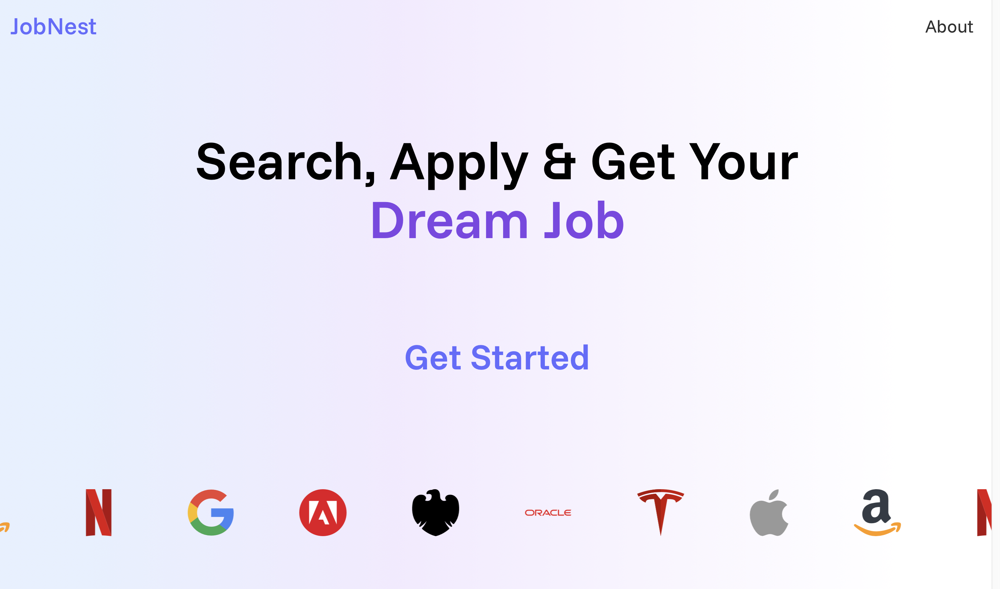
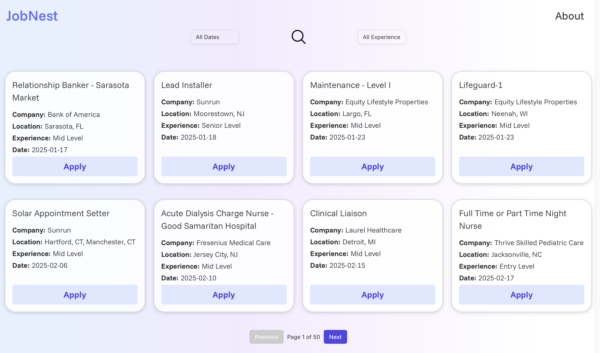
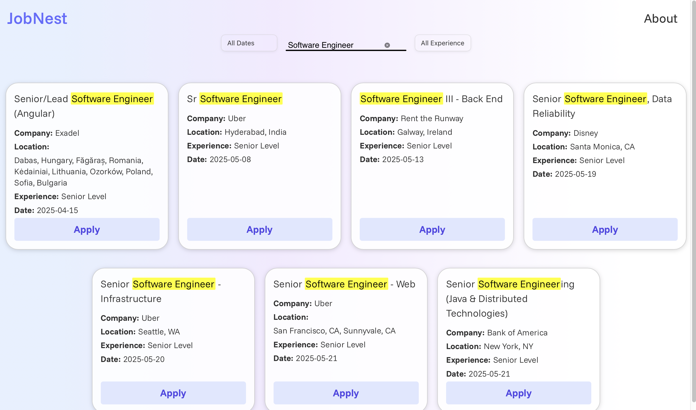
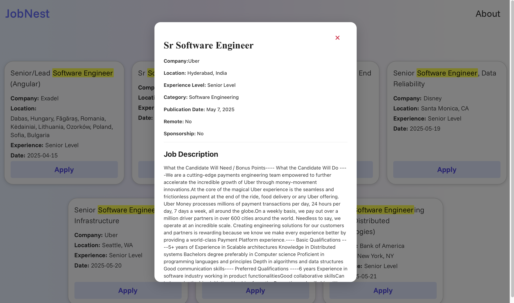

# 🧠 Job Nest

JobNest is a full-stack job portal web application designed to simplify job discovery and application processes. Built from scratch, the project showcases my skills in web scraping, API integration, Docker deployment, and Google Cloud hosting. The platform delivers a seamless user experience with powerful search and filtering features.

---

## 🚀 1. How We Created Job Nest

- Designed a modern job portal frontend using **React.js**.
- Developed a robust backend using **Python** and **Flask** to handle job data, applications, user sessions, and more.
- Implemented API proxying with **NGINX** to connect the frontend and backend seamlessly.
- Containerized the entire application using **Docker**.
- Hosted the application on **Google Cloud Run** for scalable deployment.

---

## 🚀 2. Why I Built JobNest

Initially, I attempted to scrape job data from LinkedIn, but due to authentication and anti-bot measures, I pivoted to using public APIs. I ultimately chose The Muse, which offers a free API and allows scraping of up to 40 job listings per request. I also explored platforms like RemoteOK, but rate limits constrained large-scale scraping. As a result, I capped fetches at 200–300 job listings spanning the last 24 hours to 2 months, gaining valuable experience in ethical scraping and rate-limit management.

---

## 🔑 3. Key Features

- ✅ **Fetched and Scraped 200–300 Real-Time Job Listings**
  - Fetched using **[The Muse API](https://www.themuse.com/developers/api/v2)**
  - 50 jobs manually scraped for practice

- 🔍 **Powerful Search Functionality**
  - Search by **job title**, **company name**, and more

- 🧰 **Advanced Filtering Options**
  - **By Posting Date:**
    - 🕐 Last 1 day  
    - 🕒 Last 3 days  
    - 🗓️ Last 7 days  
    - 🗓️ Last 15 days  
    - 📅 Last 1 month  
    - 📅 Last 2 months  
  - **By Experience Level:**
    - 🟢 Entry Level  
    - 🟡 Mid Level  
    - 🔴 Senior Level  

- 📝 **Detailed Job View Includes:**
  - 💼 Job Title  
  - 🏢 Company Name  
  - 🎯 Experience Level  
  - 📅 Date Posted  
  - 📃 Job Description  
  - 🔗 External Apply Link  

---

## 🛠 4. Tech Stack

- **Frontend**: React, HTML, CSS, JavaScript
- **Backend**: Python, Flask
- **API Gateway**: NGINX
- **Containerization**: Docker, Docker Compose
- **Cloud Platform**: Google Cloud Run

---

## 📦 5. Deployed on Docker

- Built custom Docker image using `Dockerfile`
- Used `docker-compose.yml` to expose the service on port `8080`
- Local deployment:

```bash
docker compose up --build
```

- Stopped containers with:

```bash
docker compose down
```

## ☁️ 6. Hosted on Google Cloud

- Docker image built and submitted using:

```bash
gcloud builds submit --tag gcr.io/YOUR_PROJECT_ID/jobportal-frontend
```

- Deployed to Google Cloud Run using:

```bash
gcloud run deploy jobportal-frontend \
  --image gcr.io/YOUR_PROJECT_ID/jobportal-frontend \
  --platform managed \
  --region us-central1 \
  --allow-unauthenticated \
  --port 8080
```

## 🔗 7. Live Website

[Click here to visit Job Nest 🌐](https://frontend-service-920994214041.us-central1.run.app/home)

## 📹 8. Video Output

▶️[Watch Demo Video](https://drive.google.com/file/d/1QA05V-v40LGbn5BKYv5njZbg0PptRW9H/view?usp=share_link)

## 🖼️ 9. Output Screenshot





